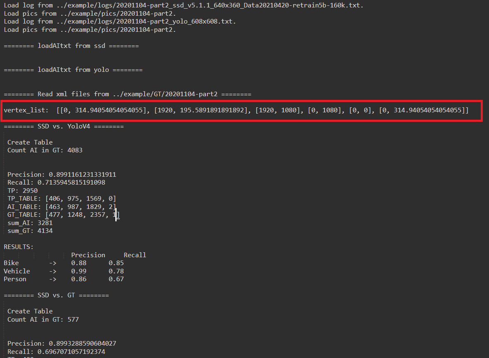

# AI_Evaluation

## A. convertIMG2BIN.py
### 1.介紹
convertIMG2BIN.py是用於SDK2.5和3.0版本下，將照片按照我們設定好的格式去分配並轉成bin檔，為後續工作做準備的程式。

### 2.操作方式
#### 步驟1.
執行convertIMG2BIN.py，並輸入圖片位置。
```
python3 convertIMG2BIN.py {圖片位置資料夾}
```

#### 步驟2.
依序輸入解析度（640、360），SDK版本，以及要切分的資料夾數目。

#### 步驟3.
取得分配完成後的檔案及資料夾。

2.5版
+ 影片名稱資料夾
   + 影片名稱資料夾
        + LabelImagework
            + 依據輸入的切分資料夾數目分配到不同資料夾的圖片
        + AMBA
            + Pics
                + 以1000張為單位分配到不同資料夾的圖片
            + Bins
                + 以1000張為單位分配到不同資料夾的bin檔
                + list資料夾
                + Run_bins.sh
   + 影片 

3.0版
+ 影片名稱資料夾
   + 影片名稱資料夾
        + LabelImagework
            + 依據輸入的切分資料夾數目分配到不同資料夾的圖片
        + AMBA
            + Pics
                + 含有所有圖片的資料夾dra_pic0
            + Bins
                + 含有所有bin檔的資料夾dra_bin0
                + list資料夾
                + Run_bins.sh
   + 影片 

### 3.Example
#### 步驟1.
執行convertIMG2BIN.py。

```
python convertIMG2BIN.py ../example/pics/20201104-part2

```


#### 步驟2.
完成檔案分配，可見分配後的檔案路徑圖。

2.5版

3.0版


## B. convertSSDLogfromRaw.py
### 1.介紹
convertSSDLogfromRaw.py 是用來將SDK2.5和3.0版本的raw log 轉換成ssd_log 的程式。

### 2.操作方式
#### 步驟1.
執行 convertSSDLogfromRaw.py ，並依序輸入raw log path及ssd_log 檔案名稱。

ssd_log 檔案名稱的命名原則如下。
```
{videoname}_{model}_{版本號}_{解析度}_{model訓練釋出日}.txt。
```

操作指令如下。
```
python3 convertSSDLogfromRaw.py \
--raw_path {raw_log 檔案名稱} --save_name {ssd_log 儲存檔案名稱}
```

#### 步驟2.
於當前路徑取得轉出的ssd_log。

### 3.Example

#### 步驟1.
依據所提供的資料路徑執行convertSSDLogfromRaw，指令如下。

>raw log path: ../example/logs/raw_log/SDK2.5/Bins2.5_ssd_v5.1.1_640x360_Data20211101-retrain3-145k.txt  
>videoname: 20201104-part2  
>model: ssd  
>版本號: v5.1.1  
>解析度: 640x360  
>model訓練釋出日: Data20211101-retrain3-145k


```
python3 convertSSDLogfromRaw.py \
--raw_path ../example/logs/raw_log/SDK2.5/Bins2.5_ssd_v5.1.1_640x360_Data20211101-retrain3-145k.txt \
--save_name ../example/logs/20201104-part2_ssd_v5.1.1_640x360_Data20211101-retrain3-145k.txt \
```


>raw log path: ../example/logs/raw_log/SDK3.0/Bins3.0_ssd_v5.1.1_640x360_Data20211101-retrain4-155k.txt  
>videoname: 20201104-part2  
>model: ssd  
>版本號: v5.1.1  
>解析度: 640x360  
>model訓練釋出日: Data20211101-retrain4-155k 

```
python3 convertSSDLogfromRaw.py \
--raw_path ../example/logs/raw_log/SDK3.0/Bins3.0_ssd_v5.1.1_640x360_Data20211101-retrain4-155k.txt \
--save_name ../example/logs/20201104-part2_ssd_v5.1.1_640x360_Data20211101-retrain4-155k.txt \
```


#### 步驟2.
取得轉出的ssd_log 。


## C. evaluatePrecisionRecall.py
### 1.介紹
evaluatePrecisionRecall.py是以libs/PMXLIB_Evaluation.py為Library的程式，其功能包含了寫XML及計算Precision & Recall。其中計算Precision & Recall包含了計算全畫面、畫線區域內兩種。

### 2.操作方式
#### 步驟1.
執行evaluatePricisionRecall.py時，輸入的指令由`(SSD_LOG) -> (YOLO_LOG) -> (GT_PATH) -> (Pic_PATH) -> (其他功能)` 所構成，可以用help (-h) 指令查詢。
```
python3 evaluatePrecisionRecall.py  --ssd_path {ssd_log .txt}  --yolo_path {yolo_log .txt} \
--gt_path {GT xml folder} –pic_path {image folder}  -res {resolution} --draw_line {Read or image path}
```

#### 步驟2.
執行程式所獲得的檔案（.txt）會被回存到資料夾當中。

### 3.Example
計算全畫面的Precision & Recall，假設此次需要進行計算的相關資料路徑如下，且照片解析度為預設的1920*1080。
>ssd_path: ../example/logs/20201104-part2_ssd_v5.1.1_640x360_Data20210420-retrain5b-160k.txt  
>yolo_path: ../example/logs/20201104-part2_yolo_608x608.txt  
>gt_path: ../example/GT/20201104-part2  
>pic_path: ../example/pics/20201104-part2 

#### 步驟1.
依據上方所提供的資料路徑執行evaluatePrecisionRecall.py，指令如下。若有需要自訂解析度，可輸入 -res指令。
```
python3 evaluatePrecisionRecall.py \
--ssd_path ../example/logs/20201104-part2_ssd_v5.1.1_640x360_Data20210420-retrain5b-160k.txt \
--yolo_path ../example/logs/20201104-part2_yolo_608x608.txt \
--gt_path ../example/GT/20201104-part2 \
--pic_path ../example/pics/20201104-part2 
```

#### 步驟2.
取得計算後的檔案（.txt）。


#### 狀況1：手動畫點計算畫線區域內的Precision & Recall
假如此次要以手動畫點的方式，完成對畫線區域內Precision & Recall的計算，相關資料路徑如下。
>ssd_path: ../example/logs/20201104-part2_ssd_v5.1.1_640x360_Data20210420-retrain5b-160k.txt  
>yolo_path: ../example/logs/20201104-part2_yolo_608x608.txt  
>gt_path: ../example/GT/20201104-part2  
>pic_path: ../example/pics/20201104-part2  
>sample pic path: ../example/pics/20201104-part2/20201104-part2_00000.jpg  

##### 步驟1.
執行evaluatePrecisionRecall.py，並開啟 -dl功能（輸入sample pic path）。
```
python3 evaluatePrecisionRecall.py \
--ssd_path ../example/logs/20201104-part2_ssd_v5.1.1_640x360_Data20210420-retrain5b-160k.txt \
--yolo_path ../example/logs/20201104-part2_yolo_608x608.txt \
--gt_path ../example/GT/20201104-part2 \
--pic_path ../example/pics/20201104-part2 \
--draw_line ../example/pics/20201104-part2/20201104-part2_00000.jpg  
```

##### 步驟2.
進入指定圖片後，需用滑鼠在照片上畫點形成區域。過程中若需重置視窗，可輸入 **C** 。完成後可輸入 **Q** 來關閉視窗。


##### 步驟3.
執行程式所獲得的檔案會存放到下方路徑中。




#### 狀況2：讀取座標計算畫線區域內的Precision & Recall
假如此次要以讀取座標的方式，完成對畫線區域內Precision & Recall的計算，相關資料路徑如下。
>ssd_path: ../example/logs/20201104-part2_ssd_v5.1.1_640x360_Data20210420-retrain5b-160k.txt  
>yolo_path: ../example/logs/20201104-part2_yolo_608x608.txt  
>gt_path: ../example/GT/20201104-part2  
>pic_path: ../example/pics/20201104-part2  

##### 步驟1.
執行evaluatePrecisionRecall.py，並開啟 -dl功能（輸入 read）。
```
python3 evaluatePrecisionRecall.py \
--ssd_path ../example/logs/20201104-part2_ssd_v5.1.1_640x360_Data20210420-retrain5b-160k.txt \
--yolo_path ../example/logs/20201104-part2_yolo_608x608.txt \
--gt_path ../example/GT/20201104-part2 \
--pic_path ../example/pics/20201104-part2 \
--draw_line read
```

##### 步驟2.
指令輸入後，會顯示已經被儲存的座標，此時僅需輸入前方編號即可繼續進行畫線工作。


##### 步驟3.
執行程式所獲得的檔案會存放到下方路徑中。


## D. writeXML.py
### 1.介紹
writeXML.py是一支能將LOG檔改寫成XML格式的程式。

### 2.操作說明
#### 步驟1.
執行writeXML.py時，輸入的指令由`(SSD_LOG) -> (YOLO_LOG) -> (PIC_PATH) -> (其他功能)` 所構成，可以用help (-h) 指令查詢。當中， -pic為必下的引數，而 -yolo及 -ssd則視需求輸入。若有需要自訂像素，則可以開啟 -res功能。

```
python3 writeXML.py --ssd_path {ssd_log .txt}  --yolo_path {yolo_log .txt} –-pic_path {image folder}
```

#### 步驟2.
獲得的資料會自動傳送到指定路徑。

### 3.Example:
假如此次要改寫為XML格式的檔案路徑如下。
>YOLO_PATH: ../example/logs/20201104-part2_yolo_608x608.txt  
>PIC_PATH: ../example/pics/20201104-part2 

#### 步驟1.
執行writeXML.py，並輸入對應的路徑。
```
python3 writeXML.py --yolo_path ../example/logs/20201104-part2_yolo_608x608.txt --pic_path ../example/pics/20201104-part2 

```

#### 步驟2.
處理完的資料會以XML格式，自動儲存到指定的路徑中。


## E. mAP_processing.py

### 1. 介紹

mAP_processing.py 是一支對利用機器和不同model 所產生的ssd_log 或yolo_log 進行格式轉換的程式，目的是將其內容轉換為pascalvoc.py 所需的輸入項，將會存放於路徑下生成之GTLOG和AILOG資料夾中。  
若為Auto模式則會自動執行pascalvoc.py，不需修改到pascalvoc.py之參數。

### 2. 操作說明

#### 步驟1. 輸入所需之input

mAP_processing.py 進行格式轉換的輸入項包含：log_path_GT, log_path_AI 和pic_path 三者，執行的指令如下所示。  
若希望轉檔後，直接執行pascalvoc.py ，則可以執行auto 模式

```
python3 mAP_processing.py \
--gt_path {GT xml folder} --ai_path {ssd_log or yolo_log .txt} --pic_path {image folder} \
--auto
```

#### 步驟2. 取得轉檔後的檔案

mAP_processing.py 轉檔完成後，會將相同數量跟檔名的檔案分別以txt 的格式存放於GTLOG 和AILOG 兩個資料夾當中。

### 3. Example:
#### 狀況1:以一般模式完成對GT_log 和AI_log 的轉檔工作

假設執行mAP_processing.py 所需的檔案路徑如下所示，並且僅先取得轉檔後的檔案，沒有要同步執行pascalvoc.py 。

> gt_path: ../example/GT/20201104-part2  
> ai_path: ../example/logs/20201104-part2_ssd_v5.1.1_640x360_Data20210420-retrain5b-160k.txt  
> Pic path: ../example/pics/20201104-part2  

##### 步驟1. 輸入所需之input

操作指令如下所示。

```
python3 mAP_processing.py \
--gt_path ../example/GT/20201104-part2 \
--ai_path ../example/logs/20201104-part2_ssd_v5.1.1_640x360_Data20210420-retrain5b-160k.txt \
--pic_path ../example/pics/20201104-part2 
```


##### 步驟2. 取得轉檔後的GT_log 和AI_log 檔案

轉檔完成之檔案存放於GTLOG 和AILOG 兩個資料夾，可以看到兩個資料夾當中的檔案數量和檔名是相同的。


#### 狀況2:以auto 模式於完成轉檔的同時執行pascalvoc.py

##### 步驟1. 輸入所需之input

操作指令如下所示。

```
python3 mAP_processing.py \
--gt_path ../example/GT/20201104-part2 \
--ai_path ../example/logs/20201104-part2_ssd_v5.1.1_640x360_Data20210420-retrain5b-160k.txt \
--pic_path ../example/pics/20201104-part2 \
--auto
```

##### 步驟2. 取得轉檔成功的檔案和mAP 的計算結果

可看見在auto 模式下，mAP_processing.py 會直接執行計算mAP 的pascalvoc.py ，並取得紅框中的計算結果。關於pascalvoc.py 的用途與操作方式請參考下段的介紹。


## F. pascalvoc.py

### 1. 介紹

pascalvoc.py 是一支用於計算mAP之程式，取用自[rafaelpadilla 的github](https://github.com/rafaelpadilla/Object-Detection-Metrics.git "title")。若要了解mAP 的基礎概念，可點選[此處](https://chih-sheng-huang821.medium.com/深度學習系列-什麼是ap-map-aaf089920848 "title")。

### 2. 操作說明

pascalvoc.py 的主要輸入項包含轉檔完成後的GT_log 和AI_log ，以及對於計算mAP 有影響的Threshold 值，對於pascalvoc.py 運行的相關參數可以參考下圖。


#### 步驟1. 輸入相關參數

我們計算自機器所取得成果的mAP 時，Threshold 值固定為0.2 ，並採用不顯示圖片的方式，操作指令如下。

```
python pascalvoc.py -gt {轉檔完成之GT＿log path} -ai {轉檔完成之AI_log path} -t 0.2 -np
```

#### 步驟2. 取得mAP 的計算結果

計算mAP 所取得的各類別折線圖，會存放於results 資料夾當中，並依類別單張存取。


### 3. Example: 以pascalvoc.py 計算mAP

假設執行pascalvoc.py 所需的檔案路徑如下所示，且Threshold 值同樣為0.2 ，並同樣採用不顯示圖片的方式。

> 轉檔完成之GT_log path: ./GTLOG/  
> 轉檔完成之AI_log path: ./AILOG/  

#### 步驟1. 輸入相關參數

操作指令如下。

```
python pascalvoc.py -gt ./GTLOG/ -ai ./AILOG/ -t 0.2 -np
```

#### 步驟2. 取得mAP 的計算結果


