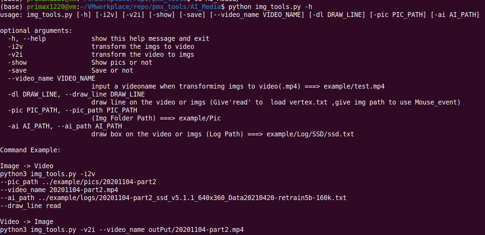
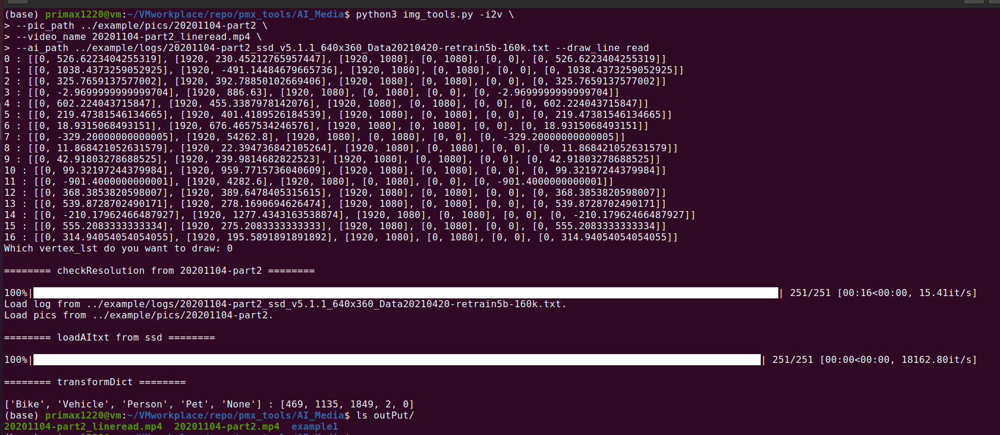
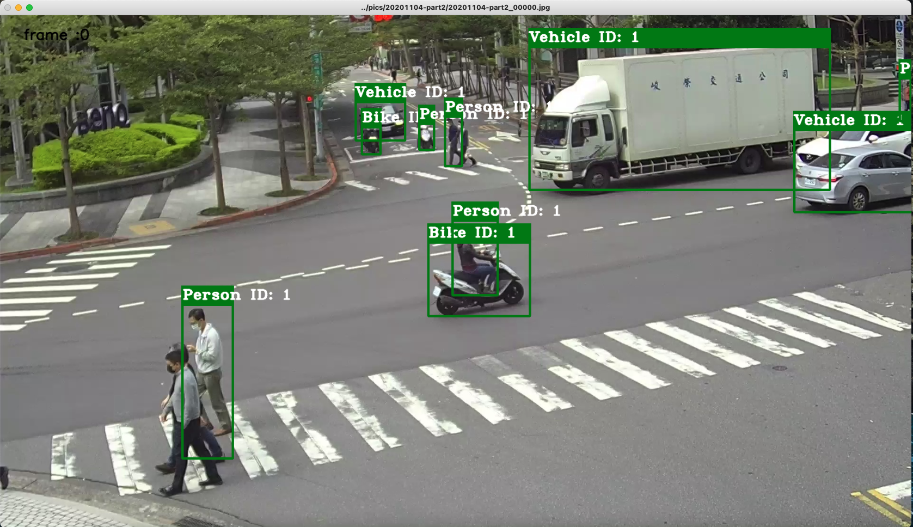
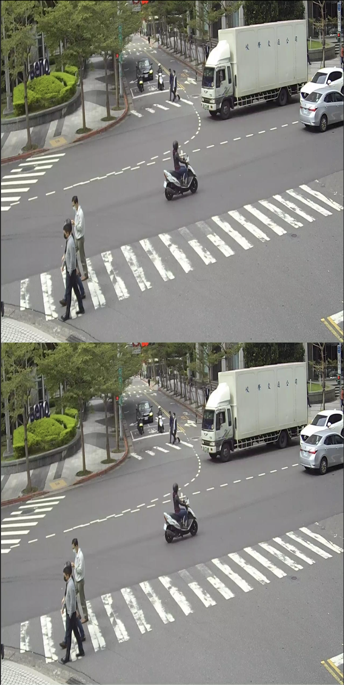

# AI_Media

## A. img_tools.py
### 1.介紹
img_tools是一支用來進行圖片與影片之間轉換的程式。

### 2.操作方式
#### 步驟1.
執行img_tools.py，並依序輸入執行該程式所需的指令。指令基本由 `(模式) -> (圖片或影片位置) -> (檔案名稱) -> (LOG位置) -> (其他功能)`  所構成，可以help（-h）指令查詢詳細說明。
```
usage: img_tools.py [-h] [-i2v] [-v2i] [-show] [-save]
                    [--video_name VIDEO_NAME] [-dl DRAW_LINE] [-pic PIC_PATH]
                    [-ai AI_PATH]
```



#### 步驟2.
執行完程式所獲得的影片檔（.mp4）和圖片檔（.jpg），會被回存到outPut資料夾中。

### 3.Example：照片轉換影片
假設此次需要處理的大量照片路徑和Log路徑如下。
>Img Folder Path: ../example/pics/20201104-part2/  
>Log Path: ../example/logs/20201104-part2_ssd_v5.1.1_640x360_Data20210420-retrain5b-160k.txt

#### 步驟1.
執行img_tools.py，指令如下，指令當中若執行 -draw的功能將在影片內看到log中所標的框。
```
python3 img_tools.py -i2v \
--pic_path ../example/pics/20201104-part2 \
--video_name 20201104-part2.mp4 \
--ai_path ../example/logs/20201104-part2_ssd_v5.1.1_640x360_Data20210420-retrain5b-160k.txt 
```

#### 步驟2.
程式執行完後，在最下方會產生一個列表，此列表呈現的是影片中各類別的數量。


#### 步驟3.
取得轉換成功的影片。


#### 狀況1：假如有開啟 -line功能
##### 步驟1.
執行img_tools.py，並開啟 -line功能（輸入read）。
```
python3 img_tools.py -i2v \
--pic_path ../example/pics/20201104-part2 \
--video_name 20201104-part2_lineread.mp4 \
--ai_path ../example/logs/20201104-part2_ssd_v5.1.1_640x360_Data20210420-retrain5b-160k.txt --draw_line read

```
##### 步驟2.
輸入想要畫線的vertex_lst值。
>Which vertex_lst do you want to draw: 0


##### 步驟3.
取得轉換後的影片檔案。影片因為有上載vertex_lst.txt，因此畫面上有依據標點座標畫出的線。




#### 狀況2：假如有開啟 -show功能
##### 步驟1.
執行img_tools.py，並開啟 -show功能。
```
python3 img_tools.py -i2v \
--pic_path ../example/pics/20201104-part2 \
--video_name 20201104-part2_show.mp4 \
--ai_path ../example/logs/20201104-part2_ssd_v5.1.1_640x360_Data20210420-retrain5b-160k.txt -show
```
##### 步驟2.
執行過程中會依序顯示接受處理的圖片，按任一按鍵即可以前往下一張，若按下Q則結束顯示並執行下一步驟。


##### 步驟3.
取得轉換後的影片檔案。


#### 狀況3：假如有開啟 -save功能
##### 步驟1.
執行img_tools.py，並開啟 -save功能。
```
python3 img_tools.py -i2v \
--pic_path ../example/pics/20201104-part2 \
--video_name 20201104-part2_save.mp4 \
--ai_path ../example/logs/20201104-part2_ssd_v5.1.1_640x360_Data20210420-retrain5b-160k.txt -save
```
##### 步驟2.
程式執行完後，會在程式所在路徑中產生一個名稱為Draw_Pics的資料夾，並同步於outPut中生成影片。


### 4.Example：影片轉換圖片
假如此次要將20201104-part2.mp4的影片轉換為圖片。
#### 步驟1.
執行img_tools.py。
```
python3 img_tools.py -v2i --video_name outPut/20201104-part2.mp4
```
#### 步驟2.
取得轉換後的圖片資料夾。


## B. concatenate.py
### 1.介紹
concatenate.py是來合成照片的程式，其目的為黏合兩張圖片來同時播放不同的影片。

### 2.操作方式
#### 步驟1.
執行concatenate.py，並輸入要黏合的兩處照片路徑。
```
python3 concatenate.py --pic_path1 A照片資料夾路徑 --pic_path2 B照片資料夾路徑
```

#### 步驟2.
取得黏合後的照片檔案。

### 3.Example
假設此次要黏合的兩處照片路徑如下。
>A照片資料夾路徑: ../example/pics/20201104-part2/  
>B照片資料夾路徑: ../example/pics/20201104-part2/

#### 步驟1.
執行concatenate.py。
```
python3 concatenate.py --pic_path1 ../example/pics/20201104-part2/ \
--pic_path2 ../example/pics/20201104-part2/
```
#### 步驟2.
取得黏合後的照片檔案。


